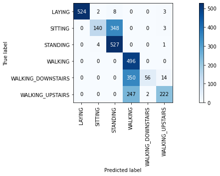
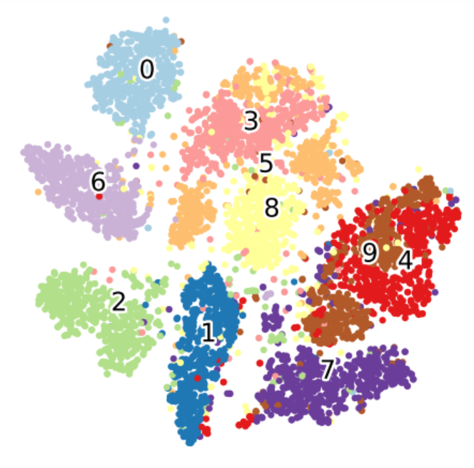
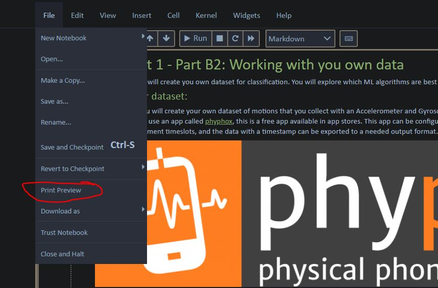
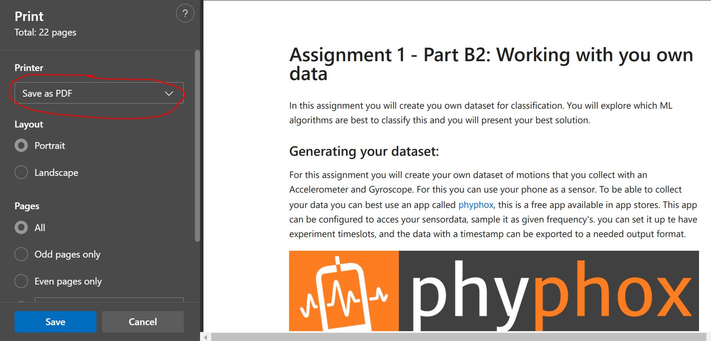

# Tips & Tricks

Here we will provide additional information, explanations, links and code snippets

Note that the jetson doesn't have all graphical packages installed (e.g. seaborne), but you can plot most information with the available tools (pandas, matplotlib)


## download datasets from the internet
To download a dataset from the internet you can use the [wget](https://en.wikipedia.org/wiki/Wget) command, this is a linux command. The exclamation mark (!) tells python that it should execute a linux commmand instead of python code. In this case the downloaded file is renamed to data.zip, which is saved on the jetson.

```
!wget https://github.com/fontysrobotics/AIS7/blob/main/Assignment1/Dataset/HAR.zip -O data.zip
```

To unzip, you can use the following python code
```
import zipfile

with zipfile.ZipFile('data.zip', "r") as z:
  z.extractall(".")
```

## Plot an appealing confusion matrix:
As we don't have seaborn available we can use the function below to make nice plots using matplotlib



Here a function to do this

```
# function to plot confusion matrix
def plot_confusion_matrix(cm,lables):
    fig, ax = plt.subplots(figsize=(15,5)) # for plotting confusion matrix as image
    im = ax.imshow(cm, interpolation='nearest', cmap=plt.cm.Blues)
    ax.figure.colorbar(im, ax=ax)
    ax.set(xticks=np.arange(cm.shape[1]),
    yticks=np.arange(cm.shape[0]),
    xticklabels=lables, yticklabels=lables,
    ylabel='True label',
    xlabel='Predicted label')
    plt.xticks(rotation = 90)
    plt.grid(b=False)
    thresh = cm.max() / 2.
    for i in range(cm.shape[0]):
        for j in range(cm.shape[1]):
            ax.text(j, i, int(cm[i, j]),ha="center", va="center",color="white" if cm[i, j] > thresh else "black")
    fig.tight_layout()
```


## visualize high-dimensional data.
t-SNE is a tool to visualize high-dimensional data. It converts similarities between data points to joint probabilities and tries to minimize the Kullback-Leibler divergence between the joint probabilities of the low-dimensional embedding and the high-dimensional data. t-SNE has a cost function that is not convex, i.e. with different initializations we can get different results.
https://scikit-learn.org/stable/modules/generated/sklearn.manifold.TSNE.html



```
from sklearn.manifold import TSNE
tsne = TSNE(random_state = 42, n_components=2, verbose=1, perplexity=50, n_iter=1000).fit_transform(X_train)
plt.figure(figsize=(18,12))
colors = {'STANDING':'red', 'SITTING':'green', 'LAYING':'blue', 'WALKING':'yellow', 'WALKING_DOWNSTAIRS':'orange', 'WALKING_UPSTAIRS':'black'}
plt.scatter(x =tsne[:, 0], y = tsne[:, 1], edgecolor="k" , c=df_train["Activity"].map(colors) )
```
---
## generating PDF's

To generate pdf's from within jupyter notebook there are multiple options, the one without installing is selecting a print preview as shown below.

(Alternative options are through the download-as menu option, but then you need to install additional packages).



A new tab in your browser will appear with a print preview.
In the new browser tab select the print option from the browser menu, or press **CTRL-P.**

The printing dialog window will appear.
Select a PDF printer that is supported for your system (e.g., save as pdf, Microsoft print to PDF) and press save.


