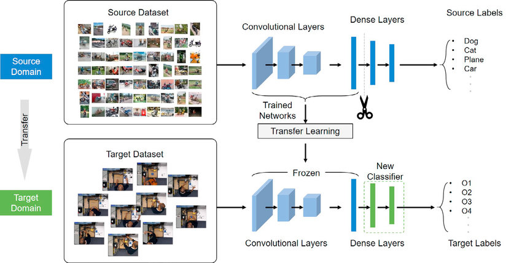

# Transfer Learning

In the this part you are going to modify a pre-trained neural network, so that it can detect objects where the initial network is not trained for. This modification of an existing pre-trained network for other tasks is called transfer learning.  

## workflow
Transfer learning consists of taking features learned on one problem, and leveraging them on a new, similar problem. For instance, features from a model that has learned to identify racoons may be useful to kick-start a model meant to identify tanukis. [Source](https://keras.io/guides/transfer_learning)

Transfer learning is usually done for tasks where your dataset has too little data to train a full-scale model from scratch.

The most common incarnation of transfer learning in the context of deep learning is the following workflow:

1. Take layers from a previously trained model.
2. Freeze them, so as to avoid destroying any of the information they contain during future training rounds.
3. Add some new, trainable layers on top of the frozen layers. They will learn to turn the old features into predictions on a new dataset.
4. Train the new layers on your dataset.

A last, optional step, is fine-tuning, which consists of unfreezing the entire model you obtained above (or part of it), and re-training it on the new data with a very low learning rate. This can potentially achieve meaningful improvements, by incrementally adapting the pretrained features to the new data.

This Transfer learning & fine-tuning workflow including example code is described in detail on this website.
https://keras.io/guides/transfer_learning/

The workflow is shown in this video, where transfer learning is used to adapt a pre-trained model to be able to classify different kind of flowers. Where the flower examples come from a (standard) dataset.

https://youtu.be/DyPW-994t7w

<!--
Before you can start transfer learning, you first have to setup the Jetson to be used for this assignment, then you will get acquainted with Inference and we will provide you with some information about transfer learning on the given network. After reading / doing these steps you can move on to the Assignment.

## Preparation Jetson

You are going to use **another docker image**, new tools and a camera for this assignment, first check the
[PartC_GettingStarted.md](PartC_GettingStarted.md) how to get everything up and running!

> **NOTE: Before Launching your Docker container.** Be aware that it will search and use the available screens and video devices, so, you must have your camera plugged when starting the container otherwise it won't be able to attach it. Please use either a Desktop terminal (external Screen) or VNC before launching the Docker image, if you use SSH instead, you will get the no "X window" available Warning!.

Launch the docker container: `$ ./inference` . This takes care of launching the Docker container with the peripheral and mounting of Folders needed. This docker container has installed all the dependencies needed for this assignment, which means that **you must skip the Setup step in the tutorial mentioned in the given Tutorials**. Remember that you have preinstalled two Docker images in your Jetson SD Card, so, now is the time to use the second container.
-->

<!--
## Inference

Before we start talking about transfer learning, we should first talk about Inference.
Machine learning inference is the process of running live data points into a machine learning algorithm  to calculate an output. This process is also referred to as “operationalizing an ML model” or “putting an ML model into production.” When an ML model is running in production, it is often then described as artificial intelligence (AI) since it is performing functions similar to human thinking and analysis. Machine learning inference basically entails deploying a software application into a production environment, as the ML model is typically just software code that implements a mathematical algorithm. That algorithm makes calculations based on the characteristics of the data, known as “features” in the ML vernacular. [Source](https://hazelcast.com/glossary/machine-learning-inference/)

The video below shows how Object Detection inference works on the jetson, explains the network used for the Assignment and where it is pre-trained for.
Watch the video as reference, you don't need to implement the code.

https://www.youtube.com/watch?v=obt60r8ZeB0

> NOTE: If you want , you can run this inference network yourselves as described in the [PartC_GettingStarted.md](PartC_GettingStarted.md)

-->
<!--
## SSD-Mobilenet

In this assignment you will apply transfer learning while retrain the last layers. You will use the SSD-Mobilenet network. The MobileNet model is designed to be used in mobile applications, and it is TensorFlow’s first mobile computer vision model [(Source)](https://medium.com/analytics-vidhya/image-classification-with-mobilenet-cc6fbb2cd470).
MobileNet uses depthwise separable convolutions. It significantly reduces the number of parameters when compared to the network with regular convolutions with the same depth in the nets. This results in lightweight deep neural networks.  

SSD stands for Single-Shot multibox Detection
The SSD architecture is a single convolution network that learns to predict bounding box locations and classify these locations in one pass. Hence, SSD can be trained end-to-end. The SSD network consists of base architecture (MobileNet in this case) followed by several convolution layers

By using SSD, we only need to take one single shot to detect multiple objects within the image, while regional proposal network (RPN) based approaches such as R-CNN series that need two shots, one for generating region proposals, one for detecting the object of each proposal. Thus, SSD is much faster compared with two-shot RPN-based approaches.

For more details about SSD architecture and its working, please read it’s official paper.
(**Disclaimer: this is not part of the assignment!** you can get to know more [here](https://arxiv.org/abs/1512.02325) and you can find the code [here](https://github.com/weiliu89/caffe/tree/ssd), **But you don't need to**).

-->

## VGG Model

VGG stands for Visual Geometry Group; it is a standard deep Convolutional Neural Network (CNN) architecture with multiple layers. The “deep” refers to the number of layers with VGG-16 or VGG-19 consisting of 16 and 19 convolutional layers.

The VGG architecture is the basis of ground-breaking object recognition models. Developed as a deep neural network, the VGGNet also surpasses baselines on many tasks and datasets beyond ImageNet. Moreover, it is now still one of the most popular image recognition architectures.

Read more at: https://viso.ai/deep-learning/vgg-very-deep-convolutional-networks/

---
## Assignment

In this assignment you will retrain a given deep learning Model so that it can detect your  own custom  objects.

| Before you start the assignment make sure you followed the above tutorials. |
| ---|

You can find the jupyter notebook here. The notebook contains the assignment description!
> [Assignment2_PART_C.ipynb](Assignment2_PART_C.ipynb)

Follow the required steps described, place comments/conclusions/insights per step and answer the given questions in the Notebook.

---

## Hints

* Create your own dataset with really distinctive objects and position them in different scenarios for getting a better generalization when deployed with life data.
*Additional info can be found in the [tips and tricks](TipsAndTricks.md) document

<!--
# Assignment: Transfer Learning on your Own Dataset

You will get to use the power of Transfer learning with **your own dataset**. So in this assignment you are going to retrain the given SSD-Mobilenet Model with your own detectable objects (at least 3 different objects). For doing so, you should follow the next step:

> NOTE: **Read the entire Assignment before reading any of the mentioned tutorials !**

* The above [video](https://www.youtube.com/watch?v=2XMkPW_sIGg) will lead you through the assignment, so, **you must watch it entirely** and repeat the process implemented by the author. For performing Part C of Assignment2, it is not required to write a single line of Python Code, only terminal scripts.
* Read and follow [this tutorial](https://github.com/dusty-nv/jetson-inference/blob/master/docs/pytorch-collect-detection.md) step by step until (included) section **Training your Model**. **Be aware!**, in the section **Launching the Tool** your tool is already installed in the Docker container, so, launch it using: `$ camera-capture python/training/detection/ssd`
* Use between 25 to 50 images for each class for at least 3 classes
   and be sure that you take the images from different angles and different distances for each object. In other words, changing the environment where your objects are while training will lead to a better performance (generalization).
* If you desire to use existing images for training your model, you can see the [Aditional Material](#aditional-material) but limit the amount of images to a maximum of 50.

Don't forget to check the [Hints and Tips](#hints-and-tips)

As an example you can watch our own implementation of this Assignment:

After following the above mentioned two tutorials you should be good to go and take care of your deliverables!
-->

---

<!--
## Deliverables

You must retrain the given SSD-Mobilenet Model to your own detectable objects (at least 3 different objects).
You should be able to show and explain the following:

1. Your collected data should at least be useful to classify at least 3 custom objects.
2. Explain what your input object represents and how the result should be classified
3. Explain the pre-processing steps of the object training image(s) before you can feed it to the network.
4. What features do you think are extracted (relevant)?
5. Show (in report and video) how accurate your predicted model is, how does your detection behave in other unseen situations?  Also explain in what situation and why it does (not) perform well. Supported your statements by measurement data!
6. Explain the parameters that you used for re-training this network?
7. This example uses a custom (but pre-trained) network architecture, explain how it works and why it is build up this way?

You should hand in:
* A Document answering the given questions and showing the results of your classifications
* A Video showing and explaining the processs / results

-->

<!--

## Hints and Tips

Not much to add except for:
* Create your own dataset with really distinctive objects and position them in different scenarios for getting a better generalization when deployed with life data.

* When training the SSD-Mobilenet Model for the first time while following the tutorial, please limit the amount images to use to less than 100 and use no more than 3 classes to save time and to ensure that it wont crash.
* When retraining for your own dataset use no more than 50 images for each class and no more than 5 classes, for the shared example implementation we used just 25 images and it gives a fair enough performance when at a close distance and with nothing in front of the object.
-->

<!--

---

## Aditional Material

### Train your SSD-Mobilenet Model with The Open Images dataset

For training your SSD-Mobilenet model with the [Open Images](https://storage.googleapis.com/openimages/web/visualizer/index.html?set=train&type=detection&c=%2Fm%2F0fp6w) dataset contains over 600 object classes that you can pick and choose from. Read and follow step by step [this tutorial](https://github.com/dusty-nv/jetson-inference/blob/9b66fbf38dcd0e81f37eb3748db3df0a221b4fa7/docs/pytorch-ssd.md), you should skip the **Setup** section of the tutorial, but if you insist in following it, then remember that you already have the Docker container preinstalled.

-->
