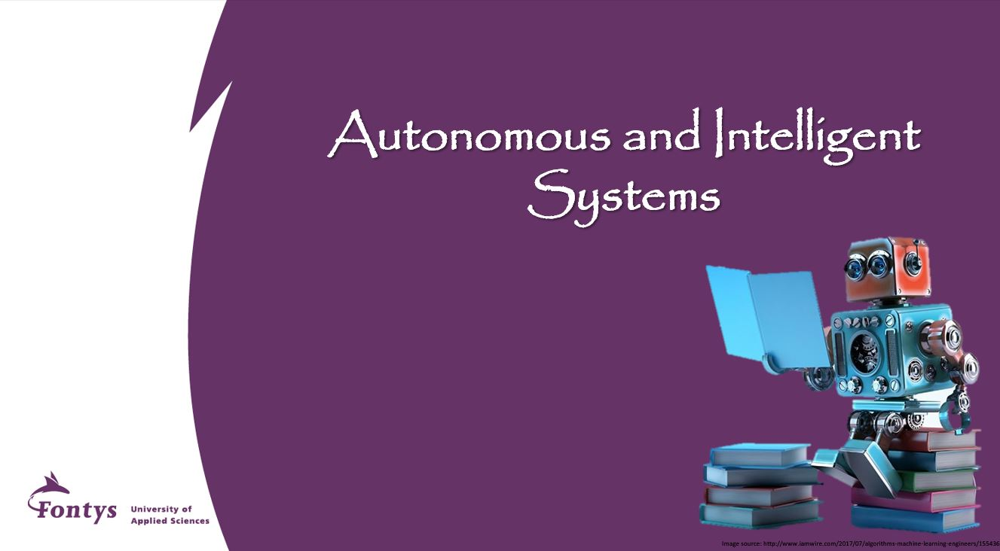

# AIS7

In this repository you can find all the needed material for the assignments related to the 4th year Autonomous & Intelligent Systems course of Fontys Mechatronics.

<!--
## Introduction
We have prepared a Jetson Nano (2GB), a case for protecting the Jetson Nano and a SD card where you will install a Linux image with two Docker images inside (one for each assignment). The given Linux + Dockers images have all the needed libraries and dependencies for following the tutorials and for developing your assignments.
-->

Each assignment contains all the information that you might need for achieving your learning goals. Please look at each assignment folder and read the README.md file for getting to know what is inside the folder and where to find the information that you might seek.

## Software

We will use Python as our main programming language and specific tools & libraries which are required for machine learning, deep learning and visualization.
You also need to install JupyterLab to be able to run the given notebooks

**Follow [these instructions](Setting_up_Software.md) to set-up the Software environment.**

<!--
## Background Information: Hardware & Linux image

1. Hardware:
    1. Jetson Nano (2GB)
        You can get to know more about this NVIDIA Jetson [Here](https://www.nvidia.com/en-us/autonomous-machines/embedded-systems/jetson-nano/education-projects/)
    2. SD card of 32GB
    3. Casing for the Jetso: This casing must be assamble by you following the steps described [Here](https://www.okdo.com/wp-content/uploads/2021/03/assembly-instructions-OKdo-Jetson-nano2-GB-Metal-case.pdf)
    4. WIFI dongle.
    5. Power supply (usb-c)
    6. Camera (needed for assignment 2)
    7. USB cable to connect the Jetson to your laptop

2. The **SD CARD image provided** for this course has the following Docker containers preinstalled:
    **(_The below Docker images are given, you don't have to install them!_)**
    1. For Assignment 1, you will use the Docker image [l4t-ml](https://eur01.safelinks.protection.outlook.com/?url=https%3A%2F%2Fcatalog.ngc.nvidia.com%2Forgs%2Fnvidia%2Fcontainers%2Fl4t-ml&data=04%7C01%7Cp.negreterubio%40fontys.nl%7C8cdd7f24286c472001c408d9a9223003%7Cc66b6765b7944a2b84ed845b341c086a%7C0%7C0%7C637726786555504240%7CUnknown%7CTWFpbGZsb3d8eyJWIjoiMC4wLjAwMDAiLCJQIjoiV2luMzIiLCJBTiI6Ik1haWwiLCJXVCI6Mn0%3D%7C3000&sdata=EohueTF6LoczrE%2BrRxceihJTRWvlrZh0K0atHIJ8wR8%3D&reserved=0) which contains TensorFlow, PyTorch, JupyterLab, and other popular ML and data science frameworks such as scikit-learn, scipy, and Pandas pre-installed in a Python 3.6 environment.
    2. For Assignment 2, you will use a standard [JetPak SDK](https://developer.nvidia.com/embedded/jetpack) provided by NVIDIA and includes the Jetson Linux Driver Package (L4T) with Linux operating system and CUDA-X accelerated libraries and APIs for Deep Learning, Computer Vision, Accelerated Computing and Multimedia

## Before starting the assignments

* **Be aware!, you cannot start your assignment without following this steps**

1. Make sure that you already have build the case for the Jetson as described [Here](https://www.okdo.com/wp-content/uploads/2021/03/assembly-instructions-OKdo-Jetson-nano2-GB-Metal-case.pdf). Please!, make sure that you install all the components including the SD card protection, screws and Power Button. **When installing the power button you must use ESD Protection, if you don't have the ESD protection, then better mount it without connecting the cables (we don't want to lose the power buttons.)**
2. Follow the steps described in the [Setting up Jetson AIS7.md](https://github.com/fontysrobotics/AIS7/blob/main/Setting_up_Jetson_AIS7.md) file.
-->

## Start your Assignment
After your installation you can start the assignments.
There are two main assignments with several sub-Assignments.
For all the assignments there are tutorials provided to get you started.
For each sub-assignment a jupyter notebook is provided to guide you trough the deliverables.

The two main assignments have a hard deadline (end wk3 and end wk6) and should be handed in on canvas.

1. in Assignment 1 you will learn how to gather and analyze your own sensor data and you will
learn how to classify this data using several Machine Learning algorithms

 [You can find Assignment1 here](Assignment1/README.md).

2. in Assignment 2 you will dive into the world of neural networks and Deep Learning.  

 [You can find Assignment2 here ](Assignment2/README.md).
